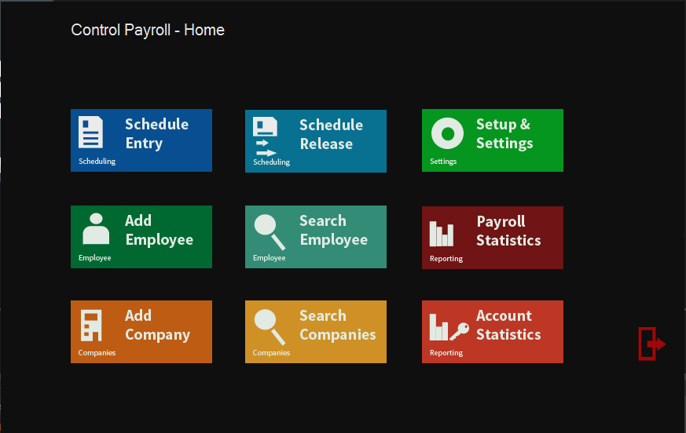
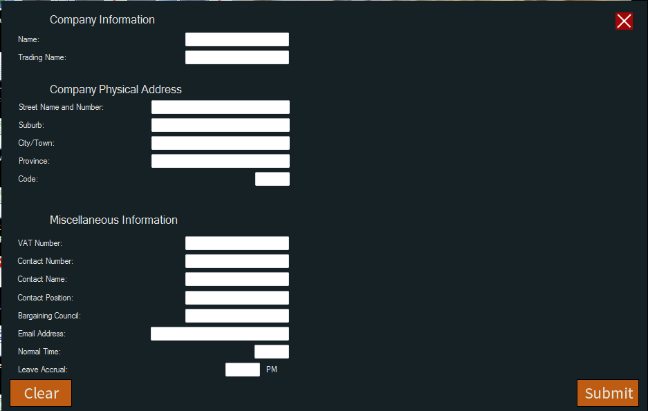
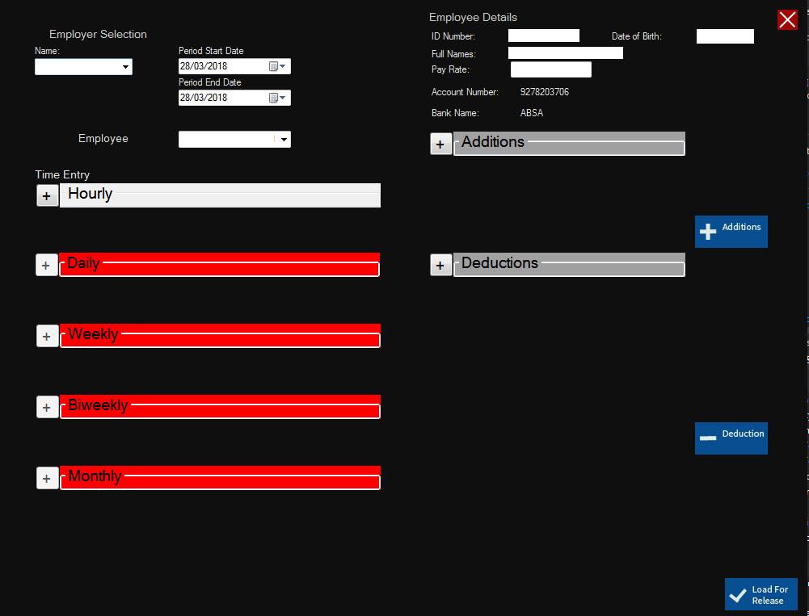
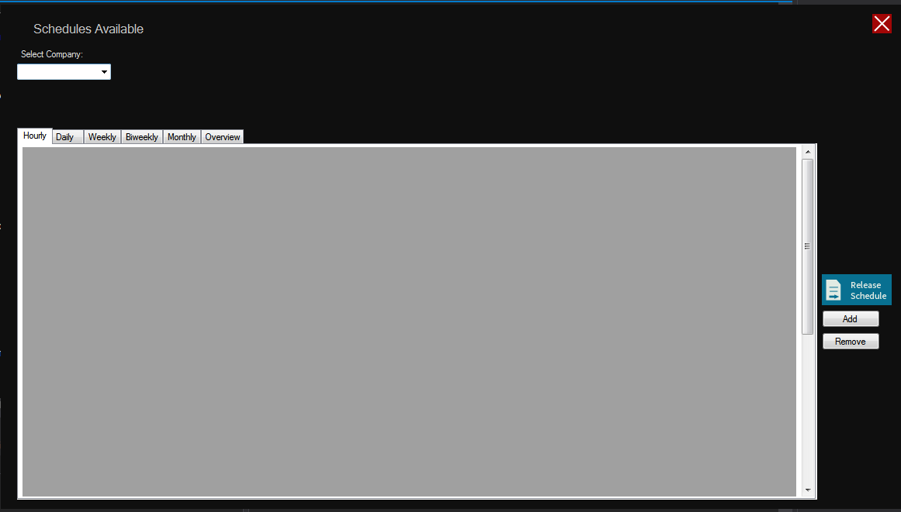

# payroll early version

the code above is an early outdated version for the calculation of pay forms.

the screenshots below are of the various interfaces for the program itself as is used today.

this is the main menu where you can access every part of the system, if the permissions for the account allow it.

Here you can add a new company with relevant details to be able to add employees to them.

Creating a new profile for each new employee that starts working and assign them to the relevant company for the lifetime of their employment.

Scheduling employees' payment and all the details regarding their current pay cycle.

Reviewing and releasing scheduled payrolls for payment and generation of payslips and deductions.

The entire system had a development time of 3 Years start to finish.
